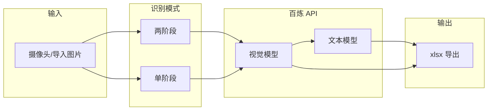

# OCR 表格识别（ocrTable）

基于 **PyQt5** 的 Windows 桌面应用：通过摄像头或本地图片采集表格照片，调用**阿里云百炼（DashScope）**视觉大模型进行 OCR，自动识别表头与行数据并导出 **Excel（.xlsx）**。

技术路线与姊妹项目 [`whMoctcInput`](E:\python\cursor\whMoctcInput) 相近（PyQt5 + OpenCV + 百炼 Qwen-VL），本仓库聚焦**通用表格**场景，不绑定领料单/ERP 业务字段。

---

## 功能概览

### 拍照识别

- 摄像头实时预览、拍照、多选导入图片
- 照片列表（文件名展示）、勾选批量 OCR
- 多任务并发识别，界面实时日志
- 识别结果导出 xlsx，支持「另存为」与导出目录列表

### 历史记录

- 查看过往 OCR 任务与结果摘要
- 数据保存在 `data/history.json`

### 系统设定

| Tab | 内容 |
|-----|------|
| **模型设置** | API 地址 / Key、视觉模型、文本结构化模型、两阶段/单阶段模式、深度思考（qwen3）、Tokens、超时 |
| **提示词** | Stage1 视觉转写、Stage2 JSON 提取、单阶段提示词（可编辑、可恢复默认） |
| **设备** | 摄像头探测与选择；采集分辨率（预设 + 自定义宽高）、JPEG 质量 |

设定写入 `data/app_settings.json`，并可同步到 `.env`。

---

## 技术栈

| 层级 | 选型 |
|------|------|
| UI | PyQt5 |
| 摄像头 | OpenCV（Windows 优先 DirectShow） |
| OCR | 阿里云百炼兼容 OpenAI 接口（`qwen-vl-ocr-latest`、`qwen3.*`、`qwen-plus` 等） |
| 导出 | openpyxl |
| 配置 | python-dotenv + `app_settings.json` |

---

## OCR 流程



- **两阶段（默认）**：Stage1 图片 → Markdown 转写；Stage2 转写文本 → `{"headers":[],"rows":[]}` JSON  
- **单阶段**：一张图 + 提示词 → 直接 JSON  
- **深度思考**：视觉模型名含 `qwen3` 时，可按设定发送 `enable_thinking`（仅 qwen3 系列有效）

---

## 环境要求

- Windows 10/11（开发与打包目标平台）
- Python 3.10+（当前开发环境 3.13）
- 摄像头（可选，亦可仅导入图片）
- 阿里云百炼 API Key（DashScope）

---

## 快速开始

### 1. 克隆与虚拟环境

```powershell
cd E:\python\cursor\ocrTable
python -m venv .venv
.\.venv\Scripts\Activate.ps1
pip install -r requirements.txt
```

若 PowerShell 禁止脚本执行：

```powershell
Set-ExecutionPolicy -Scope CurrentUser RemoteSigned
```

### 2. 配置

```powershell
copy .env.example .env
```

编辑 `.env`，至少填写：

```env
VISION_API_KEY=你的百炼_API_Key
```

其余项可在应用内「系统设定」修改；保存后会写入 `data/app_settings.json` 并同步 `.env`。

### 3. 运行

```powershell
python main.py
```

---

## 目录结构

```
ocrTable/
├── main.py                 # 应用入口（加载 .env、启动主窗口）
├── config.py               # 配置：.env + app_settings.json，frozen 时 BASE_DIR=exe 目录
├── requirements.txt
├── ocrTable.spec           # PyInstaller 打包配置
├── .env.example            # 环境变量模板
├── ocr/
│   └── bailian.py          # TableOCR：百炼调用、JSON 解析、日志
├── ui/
│   ├── main_window.py      # 主窗口与导航
│   ├── styles.py           # 界面样式
│   └── pages/
│       ├── capture_page.py # 拍照识别
│       ├── history_page.py # 历史记录
│       └── settings_page.py# 系统设定
├── utils/
│   ├── camera.py           # 摄像头打开、探测、分辨率尝试
│   ├── excel_export.py     # OCR 结果 → xlsx
│   └── history.py          # 历史记录读写
├── data/                   # 运行时数据（勿提交敏感内容）
│   ├── app_settings.json   # 界面保存的设定
│   ├── history.json
│   ├── images/             # 拍照/导入原图
│   └── exports/            # 生成的 xlsx
├── logs/
│   ├── app.log             # 应用日志
│   ├── ocr_YYYY-MM-DD.log  # OCR 流程摘要（耗时、tokens、行列数）
│   └── ai_prompts_YYYY-MM-DD.log  # 完整提示词与识别原文（调试用）
├── docs/
│   └── rm.md               # 打包与部署详细说明
└── scripts/
    └── build_dist.ps1      # 一键打包脚本
```

---

## 配置说明

| 变量 / 设定项 | 说明 |
|---------------|------|
| `VISION_API_URL` | 百炼兼容模式 Chat Completions 地址 |
| `VISION_API_KEY` | API 密钥（必填） |
| `VISION_API_MODEL` | 视觉模型，如 `qwen-vl-ocr-latest`、`qwen3.6-plus` |
| `VISION_ENABLE_THINKING` | 深度思考开关（0/1） |
| `TEXT_STRUCTURE_MODEL` | 两阶段 Stage2 文本模型，默认 `qwen-plus` |
| `OCR_TWO_STAGE` | 1=两阶段，0=单阶段 |
| `OCR_MAX_TOKENS` / `OCR_API_TIMEOUT` | 请求上限与超时（秒） |
| `CAMERA_INDEX` | 摄像头设备索引 |
| `CAPTURE_WIDTH` / `CAPTURE_HEIGHT` | 首选采集分辨率 |
| `CAPTURE_JPEG_QUALITY` | 拍照 JPEG 质量 1–100 |

打包后程序以 **exe 所在目录** 为根目录创建 `data/`、`logs/`（见 `config.py`）。

---

## 日志

| 文件 | 用途 |
|------|------|
| `logs/app.log` | 启动、异常等应用级日志 |
| `logs/ocr_*.log` | 每张图的识别进度、耗时、token 统计（界面友好） |
| `logs/ai_prompts_*.log` | 每次请求的完整提示词与 AI 原始输出（审计/调试） |

---

## Windows 打包与部署

采用 **目录模式**（非单文件 `-F`），便于保留 `data/`、`.env` 与日志。

```powershell
.\scripts\build_dist.ps1
```

输出：`dist\ocrTable\`（含 `ocrTable.exe`、`_internal\`、`启动.bat`、`.env.example`）。

详细说明（数据目录位置、升级方式、常见问题）见 **[docs/rm.md](docs/rm.md)**。

---

## 常见问题

**无法打开摄像头**  
在「系统设定 → 设备」刷新列表并保存；检查索引与分辨率；确认未被其他程序占用。

**OCR 报错 HTTP 401**  
检查 `VISION_API_KEY` 是否在 `.env` 或系统设定中正确填写。

**JSON 解析失败 / 列数不对**  
可在「提示词」Tab 调整 Stage1/Stage2 或单阶段提示词；两阶段模式对复杂手写表通常更稳。

**打包后找不到 data**  
勿只复制 exe，需整个 `dist\ocrTable` 文件夹；数据写在 exe 同级目录。

---

## 相关项目

- [whMoctcInput](E:\python\cursor\whMoctcInput) — 领料单/合并单 OCR 核对（含 ERP、可信度叠印等）
- 本仓库 — 通用表格 OCR + xlsx 导出，无数据库与 ERP 依赖

---

## 许可证

未单独声明许可证时，以仓库所有者约定为准；部署前请妥善保管 `.env` 中的 API Key，勿提交至版本库。
